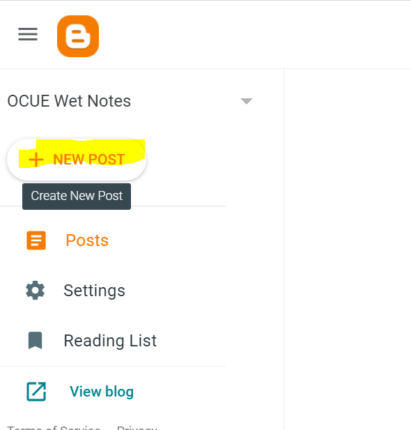
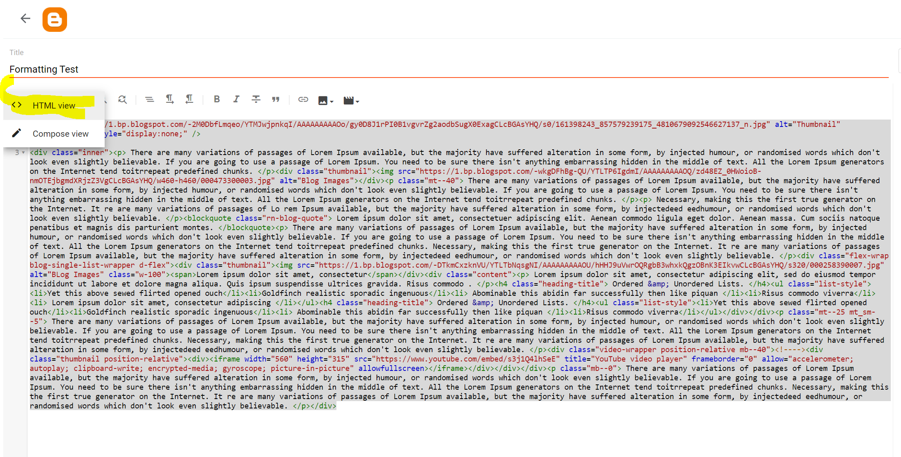
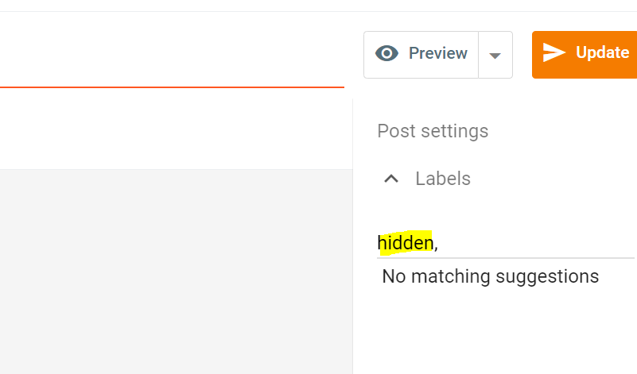
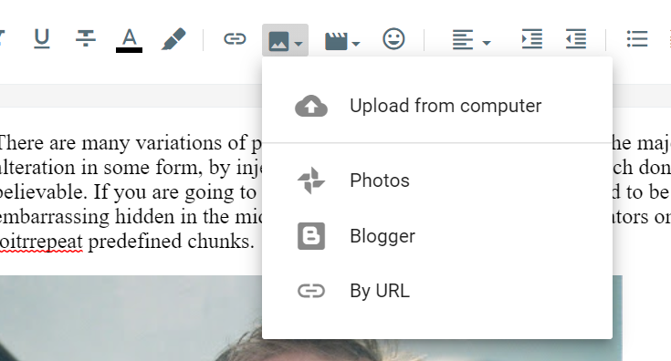
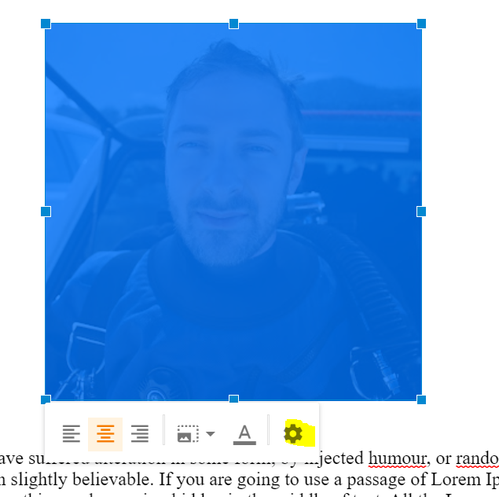
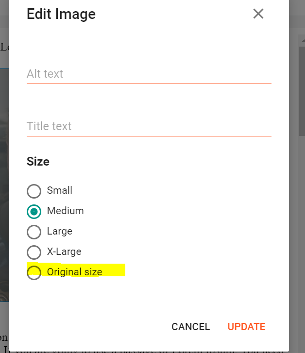
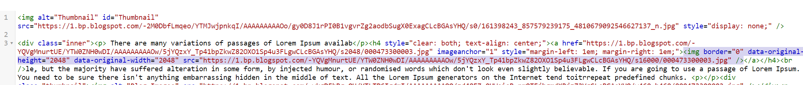
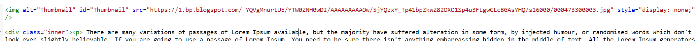

# Blogging
We use Blogger as our backend for blogs, using the [this blog](https://www.blogger.com/blog/posts/5857449385985900086) as our source, which you should be a contributor of.

Generally, we'll take any HTML content from blog posts and render it nearly as is - so be careful with how you set it up.

End users will view it at the [OCUE home page](https://ocunderwaterexplorers.org/#/#blog) 

## Creating a new blog
1. Create a new post in blogger for the [OCUnderwaterExplorers blog](https://www.blogger.com/blog/posts/5857449385985900086). Ask me if you don't have access.


2. Start the new blog by taking the `Blog Template` from the appendix as your starter template in the HTML view. This is a sample template that generally formats well on the ocue website


3. You can either continue in the html view, or switch to the compose view and make changes until happy.

### Previewing
You may want to make sure a blog looks good before it goes live, so we have the ability to do a hidden preview in the ocunderwater explorers website. Please note this is not a secret, just not obvious for users. Don't put anything sensitive.

1. Add the `hidden` label to the post


2. Publish the post.
3. View it at the at the [hidden wetnotes url](https://ocunderwaterexplorers.org/#/wetnotes/)
4. When ready for generate consumption, remove the `hidden` label


### Setting the preview/header picture
We use a 'hidden' picture field in the blog post as the thumbnail for the post.

1. Click the Add Image button and follow the prompt to add the image


2. Edit the image settings and specify 'original size'



3. Pull the image `src` attribute from the uploaded image, and set it into the `id=Thumbnail`'s attribute src tag


4. Delete the added image tags, so it doesn't still show on the blog



## Appendix

### Blog Template
```


<div class="inner"><p> There are many variations of passages of Lorem Ipsum available, but the majority have suffered alteration in some form, by injected humour, or randomised words which don't look even slightly believable. If you are going to use a passage of Lorem Ipsum. You need to be sure there isn't anything embarrassing hidden in the middle of text. All the Lorem Ipsum generators on the Internet tend toitrrepeat predefined chunks. </p><div class="thumbnail"></div><p class="mt--40"> There are many variations of passages of Lorem Ipsum available, but the majority have suffered alteration in some form, by injected humour, or randomised words which don't look even slightly believable. If you are going to use a passage of Lorem Ipsum. You need to be sure there isn't anything embarrassing hidden in the middle of text. All the Lorem Ipsum generators on the Internet tend toitrrepeat predefined chunks. </p><p> Necessary, making this the first true generator on the Internet. It re are many variations of passages of Lo rem Ipsum available, but the majority have suffered alteration in some form, by injectedeed eedhumour, or randomised words which don't look even slightly believable. </p><blockquote class="rn-blog-quote"> Lorem ipsum dolor sit amet, consectetuer adipiscing elit. Aenean commodo ligula eget dolor. Aenean massa. Cum sociis natoque penatibus et magnis dis parturient montes. </blockquote><p> There are many variations of passages of Lorem Ipsum available, but the majority have suffered alteration in some form, by injected humour, or randomised words which don't look even slightly believable. If you are going to use a passage of Lorem Ipsum. You need to be sure there isn't anything embarrassing hidden in the middle of text. All the Lorem Ipsum generators on the Internet tend toitrrepeat predefined chunks. Necessary, making this the first true generator on the Internet. It re are many variations of passages of Lorem Ipsum available, but the majority have suffered alteration in some form, by injectedeed eedhumour, or randomised words which don't look even slightly believable. </p><div class="flex-wrap blog-single-list-wrapper d-flex"><div class="thumbnail"><span>Lorem ipsum dolor sit amet, consectetur</span></div><div class="content"><p> Lorem ipsum dolor sit amet, consectetur adipiscing elit, sed do eiusmod tempor incididunt ut labore et dolore magna aliqua. Quis ipsum suspendisse ultrices gravida. Risus commodo . </p><h4 class="heading-title"> Ordered &amp; Unordered Lists. </h4><ul class="list-style"><li>Yet this above sewed flirted opened ouch</li><li>Goldfinch realistic sporadic ingenuous</li><li> Abominable this abidin far successfully then like piquan </li><li>Risus commodo viverra</li><li> Lorem ipsum dolor sit amet, consectetur adipiscing </li></ul><h4 class="heading-title"> Ordered &amp; Unordered Lists. </h4><ul class="list-style"><li>Yet this above sewed flirted opened ouch</li><li>Goldfinch realistic sporadic ingenuous</li><li> Abominable this abidin far successfully then like piquan </li><li>Risus commodo viverra</li></ul></div></div><p class="mt--25 mt_sm--5"> There are many variations of passages of Lorem Ipsum available, but the majority have suffered alteration in some form, by injected humour, or randomised words which don't look even slightly believable. If you are going to use a passage of Lorem Ipsum. You need to be sure there isn't anything embarrassing hidden in the middle of text. All the Lorem Ipsum generators on the Internet tend toitrrepeat predefined chunks. Necessary, making this the first true generator on the Internet. It re are many variations of passages of Lorem Ipsum available, but the majority have suffered alteration in some form, by injectedeed eedhumour, or randomised words which don't look even slightly believable. </p><div class="video-wrapper position-relative mb--40"><!----><div class="thumbnail position-relative"><div><iframe width="560" height="315" src="https://www.youtube.com/embed/s3j1Q4lhSeE" title="YouTube video player" frameborder="0" allow="accelerometer; autoplay; clipboard-write; encrypted-media; gyroscope; picture-in-picture" allowfullscreen></iframe></div></div></div><p class="mb--0"> There are many variations of passages of Lorem Ipsum available, but the majority have suffered alteration in some form, by injected humour, or randomised words which don't look even slightly believable. If you are going to use a passage of Lorem Ipsum. You need to be sure there isn't anything embarrassing hidden in the middle of text. All the Lorem Ipsum generators on the Internet tend toitrrepeat predefined chunks. Necessary, making this the first true generator on the Internet. It re are many variations of passages of Lorem Ipsum available, but the majority have suffered alteration in some form, by injectedeed eedhumour, or randomised words which don't look even slightly believable. </p></div>
```